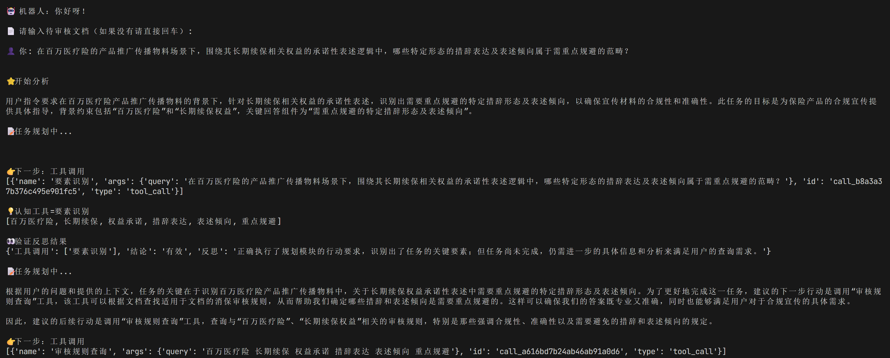
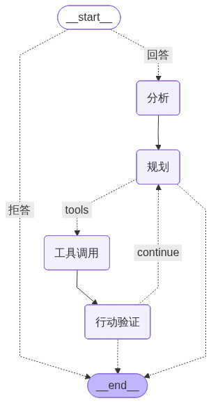

# 消保智审助手（CPIR）

该项目是用langgraph搭建一个消保智审助手（consumer-protection-intelligent-review），以满足针对用户上传宣传文案的自动化审核以及消保问答功能。

🟦 基础环境：python = 3.10
🟩 Agent框架：langgraph = 1.0.4

## 目录
- [更新日志](#更新日志)
- [1 背景简介](#1-背景简介)
- [2 快速上手](#2-快速上手)
- [3 头部产品分析](#3-头部产品分析)
- [4 搭建智能体](#4-搭建智能体)
- [5 其他运行样例（视频还没更新）](#5-其他运行样例视频还没更新)
- [6 优化思路](#6-优化思路)

## 更新日志
- [2025-01-07]：工具调用更新
  - bug修复，识别规划模块工具调用错误，最多重试3次后跳出；
  - 更新了下视频demo；
- [2025-01-05]：v1.1 版本发布
  - 新增分析节点（analyse node），一定程度上可以提高规划有效性，优化了规划模块的输出；
  - 修复之前规划和反思日志混在一起的小bug；
<div align="center">

</div>

- 2025-01-02：v1.0 版本发布，实现了宣传文案的自动化审核并输出审核过程，同时满足消保知识问答；

## 1 背景简介
- 用户是消保审核员，希望能有一个工具，实现对宣传文案的自动化审核并输出审核过程，同时满足消保知识问答。
- 用户体验过豆包在内的大模型产品，发现头部的工具已经能很好的满足需求，尤其是中间深度思考能给到业务很多审核启发。
- 希望在私有化模型上也能实现接近豆包类的审核效果，参考的内外部制度文件以输出审核过程。
  
## 2 快速上手
### 2.1 项目主要结构
```
. 📂 cpir
├── 📄 Casa_QA.py # 主程序
├── 📂 Config/
│  └── 📄 LLM_Client.py # 大模型调用接口配置
├── 📄 LICENSE
├── 📄 README.md
├── 📂 Tools/ # 工具模块
│  ├── 📂 Search/ # 检索模块
│  │  ├── 📄 RulesSearch.py # 规则检索工具
│  │  ├── 📄 TermsSearch.py # 术语检索工具
│  │  ├── 📄 consumer_protection_terms.json # 消保术语词典
│  │  ├── 📄 insurance_terms.json # 保险术语词典
│  │  └── 📄 rules.json # 审核规则列表
│  └── 📂 Thinking/ # 认知工具
│     ├── 📄 Apply.py
│     ├── 📄 Create.py
│     ├── 📄 Evaluate.py
│     ├── 📄 Remember.py
│     └── 📄 Understand.py
├── 📂 output/ # 输出目录
├── 📂 picture/ # 图片目录
│  ├── 📄 graph.png # 任务执行流程图
├── 📂 old/ # 旧脚本
└── 📂 video/ # 执行样例
```

### 2.2 运行步骤
1. 必要步骤：在```Config/LLM_Client.py```中配置好大模型的API信息。不同模型流式和非流式输出的参数有差异，示例中均采用流式输出配置，便于观察实时执行过程；
2. 可选步骤：在```Case_QA.py```最开始```tools```中选择使用的工具，qwen3系列可以只用检索工具，qwen2.5可以额外配认知工具，默认是都载入；
3. 必要步骤：运行智能体脚本```python Case_QA.py```，输入宣传文案（可选）和任务指令后，会自动设计任务执行流程；

### 2.3 运行样例
模型选择qwen2.5-72b，执行一个有点绕的知识问答：```在百万医疗险的产品推广传播物料场景下，围绕其长期续保相关权益的承诺性表述逻辑中，哪些特定形态的措辞表达及表述倾向属于需重点规避的范畴？```。
可以看到，模型在理解问题后，通过调用认知工具和检索工具，查询到了相关的制度文件，最后输出答案。
<div align="center">
  
</div>

然后追问分红险文案审核，同样调用认知工具和检索工具，输出了审核结果。
<div align="center">
  
</div>

具体执行细节可参考```output/知识问答_案例审核追问.md```

## 3 头部产品分析
我们选择一个案例，看一下不同模型输出的差异。
- 宣传文案：分红险：家庭财富的最优保障选择\n\n既要稳稳的收益，又要满满的安心？呱呱分红险必选！比存款利息高、比基金更靠谱，下有 3% 保证收益托底，上有年年分红稳赚超额收益，经济再波动也能躺赢！不管是养老规划还是子女教育，都是不二之选～。
- 任务指令：请帮我指出文案中哪些内容违反消保合规问题，分别违反了什么规定？
### 3.1 思考样例
#### 豆包的思考
>用户让我分析分红险宣传文案中的消保合规问题，我需要找出哪些内容违反规定以及具体违反了什么。首先我应该搜索分红险宣传的相关监管规定，然后对照文案逐句分析。
**搜索4个关键词，参考31篇资料**
现在我需要对照搜索到的监管规定，逐句分析文案中的违规内容，找出具体违反的条款。我应该从夸大宣传、收益承诺、产品对比、风险提示缺失等方面入手。

豆包这里的顺序分别是任务解释、任务分解，然后做了要素识别并调用检索工具，最后做了信息检查。

#### deepseek的思考
>**已阅读9个网页**
用户给了一则宣传文案，想让我帮忙分析其中的消费者保护合规问题。这是一个非常实用的合规咨询需求，涉及到具体的保险营销文案审查。
我需要按照保险销售宣传的合规要求，系统性地分析文案中可能存在的问题。如果搜索结果中有足够的监管规定和案例支持，我可以按照违规类型分类整理，并用表格形式清晰呈现违规点、具体问题和涉及的规定。

deepseek这里的顺序分别是任务解释，然后调用检索工具，最后做了信息检查。

### 3.2 信息源样例
这些工具的检索内容，大致分为以下几类：
- 规章制度文档：国家金融监管总局的《保险销售行为管理办法》
- 规则库：某知识库的“消费者权益宣传活动类消保审查监管法规依据参考审查表2024版.xlsx”
- 术语词典：分红险、存款、基金等
- 相似案例：某新闻网的《岁末年初防范非法金融宣传案例》

### 3.3 模型对比
通过对比**豆包**、**deepseek**、**qwen-3**和**qwen2.5**，我们有以下发现：
- **豆包** vs **deepseek** vs **qwen-plus**：思考模式上比较相似，都会按照一定的逻辑进行分析，联网的话就会在思考的时候去检索外部信息源。
- qwen3和qwen2.5：
  - 输出内容的规则丰富性不同，qwen-plus>qwen3-8b=qwen2.5-72b>>qwen2.5-7b-instruct。同代模型规模越大知识输出越丰富，模型新一代比老一代知识新一些；
  - 审核逻辑完整性上不同，qwen-plus>qwen3-8b>qwen2.5-72b>qwen2.5-7b-instruct，说明新一代思考模型要明显超过老一代非思考模型。

### 3.4 方案设计
- ❌思路1：思维能力通过训练的方式，让模型能够自动完成这些步骤。
  - 优点：端到端
  - 缺点：需要标注数据和训练算力来提高模型审核能力，信息源还是需要外挂，考虑到项目排期、数据有限、算力紧张，暂缓实现。
- ✅思路2：基于提示工程的agent方式，分步引导模型按照一定的逻辑进行分析。
  - 优点：不需要训练或者训练部分模块，步骤可以独立优化不相互影响，信息源检索也兼容为独立步骤；
  - 缺点：需要梳理业务逻辑，并建设符合模型能力的工具集。

## 4 搭建智能体

### 4.1 主流程
见```Case_QA.py```，里面是agent的主要结构，主要包括拒答判断、任务分析、规划、行动、反思4个步骤。
<div align="center">
  
</div>

#### 4.1.1 拒答判断（reject）
判断当前任务是否存在安全风险，若存在则拒答并回复兜底话术后结束，能回答就到规划模块。
```
def reject(state: State):
    
    ...
    
    if "回答" in response:
        return "回答"
    else:
        state["response"] = "很抱歉，该问题目前无法回答。"
    return "拒答"
```

#### 4.1.2 分析（analyse）
如果模型不够强，可能会在任务理解这块效果不好，影响到后续一系列的步骤。因此，借鉴其他模型的思考步骤，先加入分析模块，引导模型更好地理解任务指令，为后续的“规划-行动-反思”提供更准确的输入。
```
def analyse(state: State) -> State:
    """
    对给定问题的做初始的分析
    """
    query = state["query"]
    messages = state["messages"]
    ctx = get_runtime(ContextSchema)
    document = ctx.context.get("document", "")

    ...

    return {"messages": AIMessage(content=response)}
```

#### 4.1.3 规划（planing）
基于当前的agent状态，决定下一步要执行什么动作。如果信息已经足够了就直接作答，反之调用工具进行后续的操作。

具体来说，先用自带的```bind_tools```方法绑定工具，让大模型能够选择工具。
```
# 载入工具
tools = [
    recalling,  # 上下文回忆
    recognizing,  # 要素识别
    interpreting,  # 任务解释
    exemplifying,  # 任务举例
    decompose,  # 任务分解
    checking,  # 信息检查
    critiquing,  # 方案评论
    direct_answer,  # 直接作答
    insurance_terms_search,  # 保险术语查询
    consumer_protection_terms_search,  # 消保术语查询
    rules_search,  # 审核规则查询
]
llm_with_tools = llm.bind_tools(tools)
```
然后基于文案（如果存在）、用户指令和当前的agent状态（历史执行步骤），生成下一步的计划。需要判断模型输出中```tool_calls```字段是否存在，如果存在就说明需要调用工具，否则大模型会直接在```content```字段中输出答案。
```
def planing(state: State) -> State:
    
    ...
    
    gen = llm_with_tools.stream(prompt)

    ...

    # 根据是否有工具调用来判断任务结束
    if response.tool_calls:
        print(f"\n\n👉规划下一步：工具调用\n{response}")
        return {"messages": response, "n_tools": len(response.tool_calls)}
    else:
        print(f"\n\n👍任务完成")
        return {"messages": response, "response": response.content, "n_tools": 0}
```
#### 4.1.4 行动（action）
如果规划模块中存在```tool_calls```字段，里面会是一个list，会通过```ToolNode```节点来逐个调度对应工具。
PS：```ToolNode```默认是并发调用```tool_calls```列表内工具，但考虑到要体现思考，示例中都用lock来简化串行调用的封装逻辑，推荐生产环境自行实现子图串行调用。
```
tool_node = ToolNode(tools=tools)
graph.add_conditional_edges("规划", should_use_tool, {"tools": "工具调用", END: END})
graph.add_node("工具调用", tool_node)
```
#### 4.1.5 反思（reflection）
评估工具执行结果是否符合规划模块的要求，返回给规划模块以调整策略。这里增加了一个迭代次数```n_loop```，避免"规划-行动-反思"次数过多，当然也可以通过langgraph自带的```recursion_limit```来限制最大递归次数。
```
def verify_tool_call(state: State) -> State:
    
    ...

    return {"messages": AIMessage(content=response), "n_loop": state["n_loop"] + 1}
```
#### 4.1.6 循环（loop）
循环“规划-行动-反思”三个步骤，直至规划模块不再调用工具任务完成，或者超出预设循环次数任务终止。
```
graph.add_conditional_edges("行动验证", break_loop, {"continue": "规划", END: END})
```

### 4.2 认知工具

#### 4.2.1 工具池设计
封装在```Tools/Thinking```，我们的核心思路是通过认知工具弥补小模型的思考短板，缩小其与先进大模型的思考差距，这里有几个核心点需要注意：
- 基座选择：
  - 基座模型要能够理解工具池，否则选不对工具；
  - 基座模型要能够指令遵循，确保按照约束调用工具；
  - 基座模型的上下文窗口尽量长一些，复杂任务会调用多轮、检索大量信息；
- 工具选择：
  - 工具的作用是弥补差距，所以需要准备基座不具备的能力；
  - 已具备的能力是否还需要工具有待考量，可能会冲突。比如模型本身是任务解释后任务分解，我们强行拆为两个工具可能会打破原有思考模式；
  - 认知工具界定，侧重模型思考过程的能力抽象，可以参考**布鲁姆教育目标分类法**；
    
| 工具名称                   | 核心定位                                                                                                                       |
| -------------------------- | ------------------------------------------------------------------------------------------------------------------------------ |
| recalling（上下文回忆）      | 当任务需要调用长时记忆来推进时，需要通过回忆工具从历史上下文调取与当前任务相关的内容。 |
| recognizing（要素识别）  | 当任务指令中存在影响任务完成的关键信息要素（如时间、主体、规则、约束条件）时，需要通过识别工具从指令中提取出这些核心要素信息。                                         |
| interpreting（任务解释）   | 把相对抽象的任务指令，解释成具体的任务内容。                                                                                   |
| exemplifying（任务举例）   | 如果当前任务指令内包含抽象的概念，需要给出相似的任务样例来帮助理解。                                                           |
| decompose（任务分解）      | 如果当前任务过于复杂，需要拆解为若干个相对简单的子任务。                                                                       |
| checking（信息检查）       | 检查历史上下文中的执行过程，是否符合既定准则、数据或事实。                                                                     |
| critiquing（方案评论）     | 需要根据任务指令，对比上下文已经设计的方案，给出给出评判结论与依据。                                                           |
| direct_answer*（直接作答） | 当任务指令中包含直接的问题，或者上下文已经包含了足够的信息，直接回答问题。                                                     |

PS：“直接作答”本意是把思考过程全部封装为mcp工具集，使得推理步骤更统一。因为规划模块没有合适工具也会直接回答，所以不用也没问题。

#### 4.2.2 实践经验
- 弱模型：在使用qwen2.5-7b时，有一定概率陷入到某些工具频繁调用的死循环。经过分析，发现是模型对工具定义理解的不到位，对规划模块中的约束也没有严格遵循。这也体现了模型对工具理解和指令遵循的重要性。
- 强模型：在使用qwen-plus时，只要配了检索工具就够了，认知工具的效果不一定比自己思考更加强大。这也体现了模型能力和认知工具的互补性，尽量避免人工预设的思考模式与已具备的内在能力冲突。

### 4.3 检索工具
封装在```Tools/Search```，侧重模型从外部信息源中提取信息。这里只是工具检索样例所以相对粗糙，基于关键词匹配的术语定义检索，基于大模型的规则选择。实际使用中，建议用专用的检索api作为工具，如ES检索等。

知识文件如下：
| 文件名称                       | 知识说明     |
| ------------------------------ | ------------ |
| rules.json                     | 规则清单     |
| insurance_terms.json           | 保险术语定义 |
| consumer_protection_terms.json | 消保术语定义 |

检索工具如下：
| 工具名称                | 核心定位                 |
| ----------------------- | ------------------------ |
| RulesSearch（规则检索） | 检索和文案相关的审核规则 |
| TermsSearch（术语检索） | 检索相关的术语定义       |


## 5 其他运行样例（视频还没更新）
选择qwen3-8b模型，还是一样的任务指令。因为有深度思考，需要耐心等待一会。

知识问答：```在百万医疗险的产品推广传播物料场景下，围绕其长期续保相关权益的承诺性表述逻辑中，哪些特定形态的措辞表达及表述倾向属于需重点规避的范畴？```
这里直接查了规则库，完整日志见```output/知识问答.md```
<div align="center">
  
</div>

文案审核：```分红险：家庭财富的最优保障选择\n\n既要稳稳的收益，又要满满的安心？呱呱分红险必选！比存款利息高、比基金更靠谱，下有 3% 保证收益托底，上有年年分红稳赚超额收益，经济再波动也能躺赢！不管是养老规划还是子女教育，都是不二之选～```
这里也直接查了规则库，完整日志见```output/文案审核.md```
<div align="center">
  
</div>

可以看到，qwen3-8b的思考能力比较好，即使配备了认知工具，也只选择了信息检索工具来完成任务。相比之下，qwen2.5-72b的输出不是很稳健，有时候会用认知工具，有时候也只选择信息检索工具来完成任务。

## 6 优化思路
- 弱模型因为能力不足，才需要通过智能体的方法来把复杂流程分解成多个可控制的子流程。但工具选择能力或者指令遵循能力的缺陷，又很导致工具选择的不准（如频繁任务分解），因此要优先做好**工具学习**；
- 强模不需要认知工具就可以把任务执行的很好，很适合内化思考能力并端到端完成任务，**agent的轨迹可以作为一个人工合成数据用于模型训练**；
- 是否需要人为预设工具调用流转约束？目前发现还是有较大概率出现工具调用死循环，人为预设一些约束可以避免这种情况，但又会限制自主性，也有不少论文通过**序列决策任务**来优化。
- 多轮需求提出后，需要额外考虑历史上下文的压缩或者检索，以避免信息冗余影响推理效率或者信息缺失。